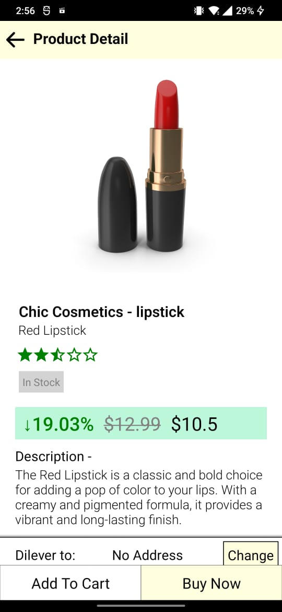
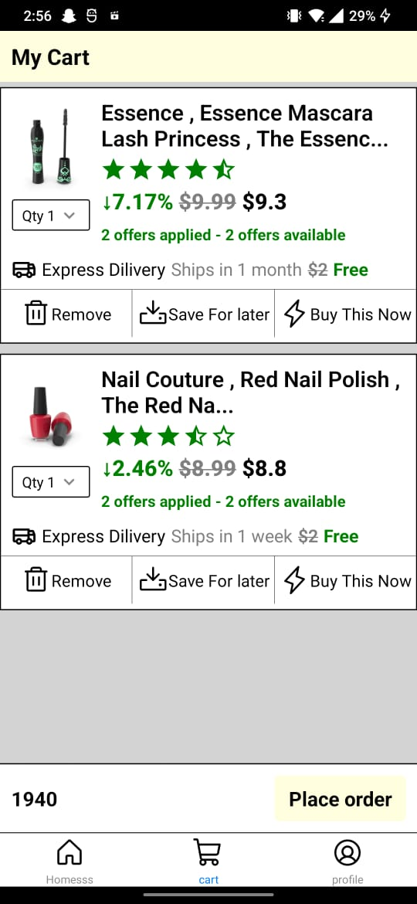
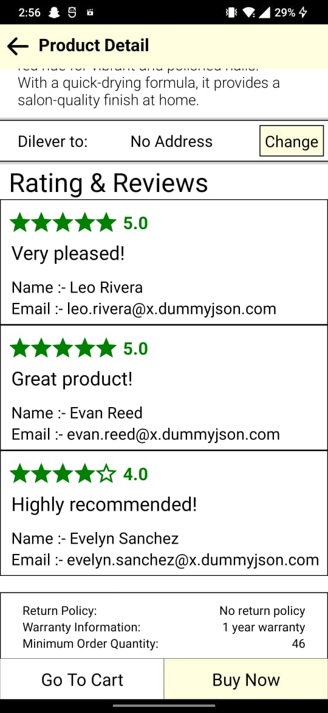

# ecommeceApp
* ecommerceApp
* Features
* Fetches data from an API using Axios
* Displays product information on the home screen, including image, price, * discount percentage, and discounted price
* Categorizes products and provides a search option in the header
* Opens a product detail screen when a product is touched, displaying product * image, price, discount percentage, discount price, rating, reviewer name, * and message
* Provides a footer with "Buy Now" and "Add to Cart" buttons. When "Add to * Cart" is pressed, the app opens a cart screen displaying added cart items

# Technologies Used
*  React Native
*  Axios
*  React Navigation
*  Redux
*  React Native Elements
*  React Native Vector Icons
*  License
*  This project is licensed under the MIT License - see the LICENSE.md file for details.

# Acknowledgments
* API documentation
* React Native documentation
* Axios documentation
* React Navigation documentation
* Redux documentation
* React Native Elements documentation
* React Native Vector Icons documentation

   
   